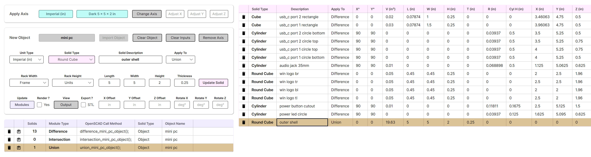
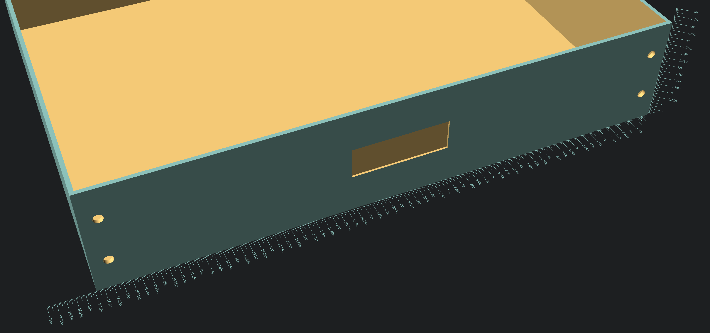
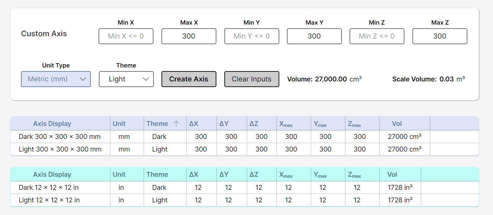

 
#  NetSCAD Tools
###### 
#### Description
This application is a no-code tool for generating custom objects used in OpenSCAD, a solid 3D CAD modeler. This simplifies the process of creating complex 3D models by providing reusable components and utilities. Currently, it includes creation of custom Imperial and Metric axes, as well as quick generation of objects to help speed up the modeling process. This allows for more precise modeling used in 3D printing. **It is assumed that users have a basic understanding of OpenSCAD and its functionalities.**
###### 
#### Prerequisites
* **You need to have the following installed:** [OpenSCAD](https://openscad.org/downloads.html)
######
**Get the latest release of NetSCAD Tools**
* [NetSCAD for Windows (x64)](NetScad.UI/NetScad.UI.Windows/NetSCAD-v0.3.0-win-x64.zip)
* [NetSCAD for Linux (x64)](NetScad.UI/NetScad.UI.Linux/NetSCAD-v0.3.0-linux-x64.tar.gz)
* [NetSCAD for Raspberry Pi (arm64)](NetScad.UI/NetScad.UI.Linux/NetSCAD-v0.3.0-linux-arm64.tar.gz)

######
#### Layout of Custom Object Designer
The Custom Object Designer is organized into several sections to facilitate the creation of custom objects for OpenSCAD. There are 5 main sections: applying a custom axis, creating a new object, setting inputs for new solids (Cube, Rounded Cube, and Cylinder), the list of Solids in the object, and Modules that contain the Solids (Union, Intersection, Difference).
###### 

######
#### Output of Custom Object in OpenSCAD
Outputs can be viewed in **real-time.** Any changes to the object within the application will automatically update the SCAD file used in OpenSCAD. This allows for quick iteration and testing of objects without needing to manually export and import files. **The object is pre-rendered in OpenSCAD upon opening the SCAD file.** Depending on the complexity of the object, this may take some time.

#### Export Custom Object to STL
Once the object is finalized, **check the Export STL box** to convert the rendered object to STL. The axis is removed by default, but reapplied after export to the preview in OpenSCAD. The STL file will be generated based on the current configuration of the object within the application.

######

######
#### Types of Solids Available
Cubes and cylinders can be generated from the Designer module within this application. Rounded versions of cubes are also available in this iteration, in order to show how to offset Minkowski rounding to align with 0,0 axes. Future iterations will have more solid types available, but if needed, generated outputs can be modified within SCAD files directly. Solids available are as follows:
###### 
* **Cube** - default aligned on the 0,0,0 axes or can be offset with translate
* **Rounded Cube** - using Minkowski rounding with offsets to align with 0,0,0 axes
* **Cylinder** - all cylinders are aligned on the 0,0,0 axes, with the center point of the top of the cylinder (center circle)
###### 
#### Types of Measurements
Varying axes of different sizes, measurement types, colors, and combinations of both metric and imperial measurements can be applied within the same SCAD project. Axes are managed in an aggregate SCAD file and are called as modules within your SCAD project. The app manages updates to existing axes as well as provides the ability for multiple axis types to be used in your project. Axis increments are as follows:
###### 
* **Metric axis** - 20mm, 10mm, 5mm, and 1mm increments
* **Imperial axis** - 1/4", 1/8", 1/16", and 1/32" increments
* **Convert mm to inches** - Enter inputs in Metric (mm) first, then select Imperial (in)
* **Convert inches to mm** - Enter inputs in Imperial (in) first, then select Metric (mm)
###### 
#### Layout of Custom Axes Builder
The Custom Axes Builder has 2 main visual sections: Custom Axis and Generated Axes. The outputs of newly created axes will show up below the Custom Axis section. This shows the total cubic size, as well as the name to use in your project file. In the list below the custom axis settings, you will see the newly created axis, along with axes that have been previously created. There are two tables that display axes information. One is metric axes and the other is imperial axes. **Both ascending and descending sorting are possible, as well as sorting by multiple categories (shift + select).**
###### 

###### 

###### 
| Files                                   | Usage In Your SCAD File                                | Optional parameters | Render |
| --------------------------------------- |:------------------------------------------------------:|:-------------------:|:------:|
| Scad/Axes/custom_axis_name.scad         | use <Axes/axes.scad>; Get_Custom_Axis_Name();          | colorVal, alpha     |	No    |
| Scad/Solids/moduleType_name_object.scad | include <object_name_type.scad>;                       |                     |	No    |
| Scad/Solids/object.scad                 |                                                        |                     |	Yes   |	
| Scad/Solids/object.stl                  |                                                        |                     |  Yes   |
